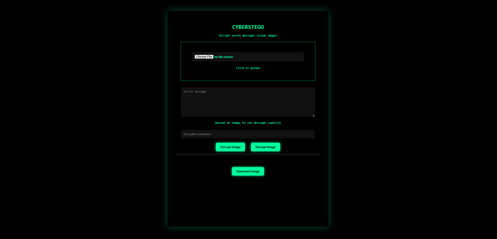
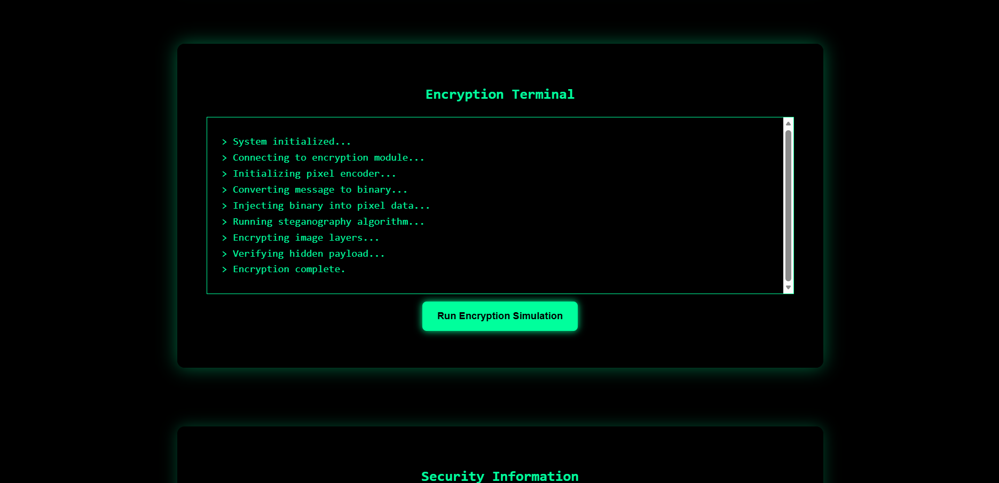
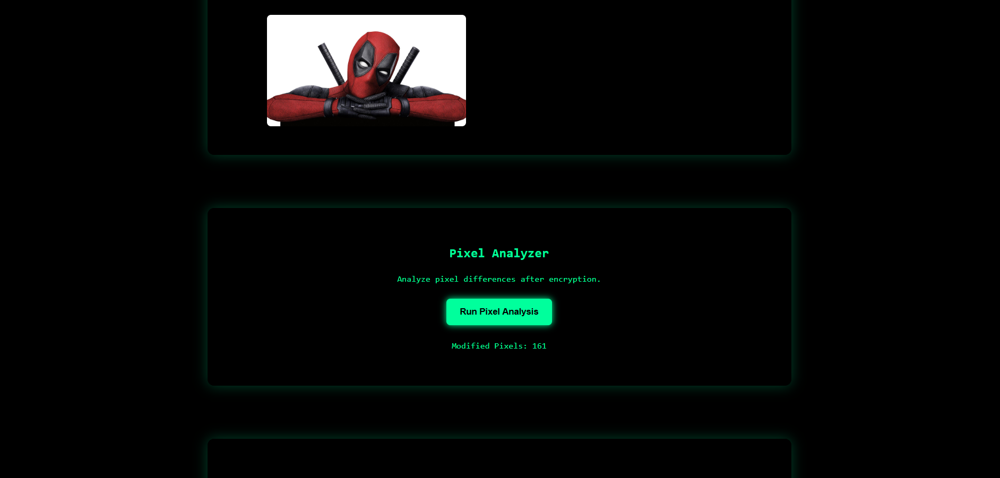

# 🔐 CyberStego
### Hide Secret Messages Inside Images

A modern steganography web app for encrypting and hiding messages inside images using AES encryption.

# 🔐 How It Works

No installation required.

Just open a link in your browser and upload an image and your message:

https://nikhil9211.github.io/Image-Encryption-Decryption-Website/

Then just download the image

---

# 📸 Screenshots

## Main Interface

## Encryption Process

## Pixel Analyzer

---

# 📊 Extra Visual Tools

Image Comparison

Shows the difference between the original image and encrypted image.

Pixel Heatmap

Highlights which pixels were modified during message embedding.

# ⚠️ Disclaimer

This tool is intended for educational purposes only.
Do not use it for illegal activities.

# 👨‍💻 Author

Created by NIKHIL KUSHWAHA

----
# ⭐ Support

If you like this project:

## ⭐ Star the repository on GitHub
## 🍴 Fork it to build your own version
